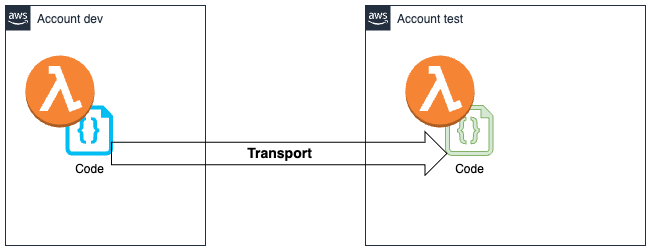

# Lambda Transport

Deploy the 100% same tested code from one development stage too another.
Transfer lambda CODE between accounts and functions




## Why

You test a version of a Lambda function in stage/account "development".
When you now re-create this tested version in a devlopment pipeline, you can not be 100% sure, that this is the same code. Libraries, dependencies, and the code itself can be different.

Transporting the binary zip of the code from one lambda to another is a way to be 100% sure that the code is the same.

## Configuration

The source and target account and lambda are defined in the file ``.transport/config.yml`.

This is the example you find in `config-example.yml`:

```yaml
config:
  dev:
    source:
      profile: dev-profile
      region: eu-central-1
      lambda: demo
    target:
      profile: test-profile
      region: eu-central-1
      lambda: demo

  test:
    source:
      profile: dev-profile
      region: eu-central-1
      lambda: demo
    target:
      profile: prod-profile
      region: eu-central-1
      lambda: demo
```

With the paramater `stage` you select an stage entry from the config file.

So `transport -stage dev` will transfer the code from the lambda `demo` with the AWS profile `dev-profile` to the lambda `demo` with the AWS profile `test-profile`.

So first copy the example file to `.transport/config.yml` and then adjust the values.

1) `cp config-example.yml .transport/config.yml`
2) `vi .transport/config.yml`

## Usage

1) Create Lambda resource in source and target account here name `transfertest`
2) Have AWS profiles

Examples `~/.aws/credentials`:

```toml
[dev-profile]
aws_access_key_id=ASIA*****D5EB
aws_secret_access_key=yCY9l****g9gY5Hcu
aws_session_token=IQoJb3Jp***7y3dVKN2pn6Od7GXd+ZzxjdBhY1X2BbK4BnRKn+Njwi2eJg0ygf+2G1JTZJMdnFO1fZjEyCQoXh9WGDVilA6njxVRm82+HaxBZweEQ==
region=eu-central-1

[test-profile]
aws_access_key_id=ASIA***OXWK
aws_secret_access_key=muhkY***+fl/3V9Q
aws_session_token=IQoJb3Jp***zTRL3ws3P+al9a/JaPjieBkWQYMN0PKeUJApG39oq+sAJ85i+/xtg==
region=eu-central-1
```

Example `.transport/config.yml`:

```yaml
config:
  dev:
    source:
      profile: dev-profile
      region: eu-central-1
      lambda: transfertest
    target:
      profile: test-profile
      region: eu-central-1
      lambda: transfertest
```

3) Run the command `transport --stage dev`

Output:

```bash
transport --stage dev
time=2024-08-25T13:51:30.230+02:00 level=INFO msg="Downloaded the ZIP file from the source lambda function" filename=downloads/transfertest.zip
time=2024-08-25T13:51:30.441+02:00 level=INFO msg="Uploaded the ZIP file to the target lambda function" functionName=transfertest revisionId=ad24d742-fb4a-4d41-a24c-3b2925258c1a
```

The Lambda Function code in the target account is now the same as in the source account.

### Install

Copy a binary from the [release page](https://github.com/megaproaktiv/lambda-transport/releases) onto you system.
